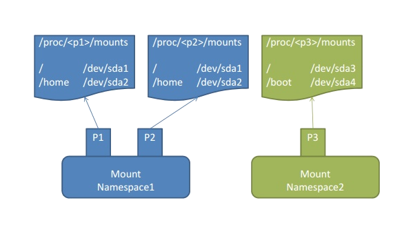
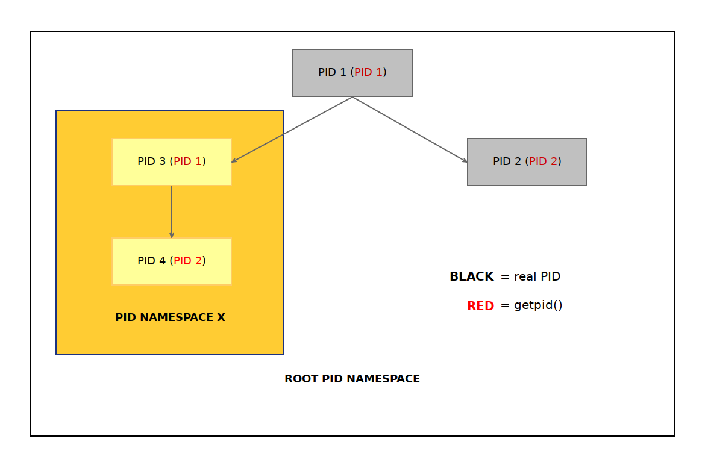

# Linux Namespaces

This section covers how the containers are isolated from the host as
well as each other using the kernel namespaces. This is actually the
most significant kernel feature which virtualizes the resources and isolates
the processes from each other and using just namespaces creates a
containers of sorts, see [nsexec](#nsexec).

## Namespaces

Pasting here the definition from the manual page
[namespaces(7)](http://man7.org/linux/man-pages/man7/namespaces.7.html) 
as there probably isn't a better one.

> A namespace wraps a global system resource in an abstraction that
> makes it appear to the processes within the namespace that they have
> their own isolated instance of the global resource.  Changes to the
> global resource are visible to other processes that are members of the
> namespace, but are invisible to other processes.

There are 7 namespaces at the moment and a process can be in one or
more of them. There are always global namespaces for each of the types
so that any process is always in some namespace of each type.

Linux has so far following namespaces.  
*Number in the brackets is the kernel version when the namespace was
introduced*

- Mount (2.4.19)  
  Isolates the mount points. A process has it's own view of the mount
  points and changes are not propagated to other namespaces.  
  [mount_namespaces(7)](http://man7.org/linux/man-pages/man7/mount_namespaces.7.html)

- UTS (2.6.19)  
  Isolates the hostname and the  NIS domain name. Calling
  [sethostname(2)](http://man7.org/linux/man-pages/man2/sethostname.2.html) or
  [setdomainname(2)](http://man7.org/linux/man-pages/man2/setdomainname.2.html) is
  affecting only the namespace.

- IPC (2.6.19)  
  Isolates IPC resources. System V IPC objects and POSIX message queues.

- PID (2.6.24)  
  Isolates the process ID number space. Processes in different PID
  namespaces can have the same PID or can't see PIDs of different
  namespace.  
  [pid_namespaces(7)](http://man7.org/linux/man-pages/man7/pid_namespaces.7.html)

- Network (2.6.29)  
  Isolates the network resources like network devices, IPv4 and IPv6
  protocol stacks, IP routing tables, firewalls etc.

- User (3.8)  
  Isolates the user and group resources, unprivileged user in the
  "root" namespace can be a user ID 0 in the new namespace. When new
  user namespace is created the user gets full
  [capabilities(7)](http://man7.org/linux/man-pages/man7/capabilities.7.html) inside
  the namespace.  
  [user_namespaces(7)](http://man7.org/linux/man-pages/man7/user_namespaces.7.html)

- Cgroups (4.6)  
  Isolates the view of the `/proc/[pid]/cgroup` and  `/proc/[pid]/mountinfo`.  
  [cgroup_namespaces(7)](http://man7.org/linux/man-pages/man7/cgroup_namespaces.7.html)
  
  
## Mount namespace

Mount namespace isolates the mount points and effectively different
namespaces can have different filesystem trees as well as any changes
in the mount points may or may not be propagated in the other
namespaces depending on the mount types (private, bind, slave etc),
see [mount(8)](http://man7.org/linux/man-pages/man8/mount.8.html). In
the container context it means that anything happening to mount points
inside the container is not propagated elsewhere so they are
completely isolated.



*Image courtesy of [Wonchang Song](https://www.slideshare.net/WonchangSong1/docker30-m/24)*


## PID namespace

PID namespace isolated the PID numbers, they are a hierarchical
structure where the parent namespace can view all the PIDs in the
child namespaces. When a new namespace is created the first process
gets the PID 1 and is a sort of init process of that namespace. It
should in the ideal world be able to reap any child processes as
otherwise it can actually exhaust the root PID space because of the
hierarchical nature.




## Network namespace

Network namespace creates a completely new network stack including
routing tables, in a new network namespace you get just the loopback
device `lo` and nothing else so you are actually unable to connect to
the network (see [nsexec](#nsexec)). Physical network interfaces can
reside in only one namespace at a time so very often to connect the
namespace somewhere the virtual Ethernet device pair
([veth pair](http://baturin.org/docs/iproute2/#Create a pair of virtual ethernet devices))
is used with together with
[Linux bridge](https://wiki.linuxfoundation.org/networking/bridge).
In any case
the [setns(2)](http://man7.org/linux/man-pages/man2/setns.2.html)
comes handy for adding a device to the namespace.  


## Creating new namespaces

There are two syscalls how to create a new namespace. 

- [clone(2)](http://man7.org/linux/man-pages/man2/clone.2.html)  
  is like [fork(2)](http://man7.org/linux/man-pages/man2/fork.2.html) but
  allows you to pick what context you share with the parent process.
  
- [unshare(2)](http://man7.org/linux/man-pages/man2/unshare.2.html)  
  is to disassociate from the parent process context and thus create a new
  one.

There is also [setns(2)](http://man7.org/linux/man-pages/man2/setns.2.html)
which allows you to enter an existing namespace.

### unshare and nsenter in the shell

You can play with the namespaces in the shell too, 
[nsenter(1)](http://man7.org/linux/man-pages/man1/nsenter.1.html) is
the command line equivalent
of [setns(2)](http://man7.org/linux/man-pages/man2/setns.2.html)
and [unshare(1)](http://man7.org/linux/man-pages/man2/unshare.1.html)
is the equivalent
of [unshare(2)](http://man7.org/linux/man-pages/man2/unshare.2.html)
syscall.


```bash
$ unshare --fork --pid --mount-proc 
```
*Runs a new shell in own PID namespace, it needs to remount the procfs
as otherwise tools like `ps` would still show the parent namespace.*


## nsexec

`nsexec` is a minimal example on how to use namespaces to isolate
processes and one could argue that it creates a container using the
host filesystem and programs.

```
./nsexec --help
Create a child process that executes a shell command in new namespace(s),
Usage: ./nsexec [OPTIONS] <CMD>

    -h, --help           print this help
    -n, --net            new network namespace
    -p, --pid            new PID namespace
    -u, --uts HOSTNAME   new UTS namespace
    -v, --verbose        more verbose output

    <CMD>                command to be executed
```

!!! seealso "See the Code"
    [nsexec.c](https://github.com/w-vi/diyC/blob/master/src/nsexec.c)

### Example

```bash
$ sudo ./nsexec -npu myhost bash
myhost> ps -ef
UID        PID  PPID  C STIME TTY          TIME CMD
root         1     0  0 10:45 pts/3    00:00:00 bash
root         6     1  0 10:45 pts/3    00:00:00 ps -ef
myhost> ip a
1: lo: <LOOPBACK> mtu 65536 qdisc noop state DOWN group default qlen 1000
    link/loopback 00:00:00:00:00:00 brd 00:00:00:00:00:00
myhost> exit
exit
```

##  More to read

- [Namespaces in operation, part 1: namespaces overview](https://lwn.net/Articles/531114/)
- [Applying mount namespaces](https://www.ibm.com/developerworks/library/l-mount-namespaces/index.html)
- [Introducing Linux Network Namespaces](http://blog.scottlowe.org/2013/09/04/introducing-linux-network-namespaces/)
- [A Follow Up on Linux Network Namespaces](http://blog.scottlowe.org/2014/03/21/a-follow-up-on-linux-network-namespaces/) 
